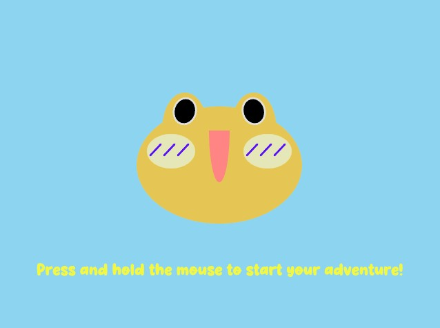
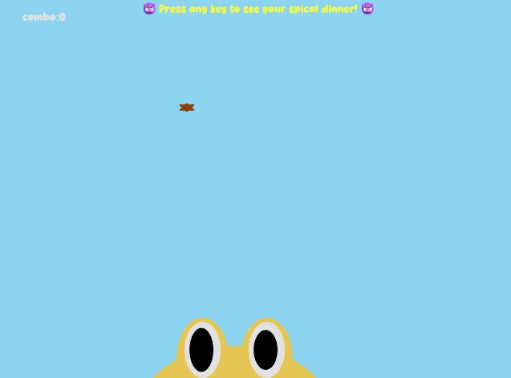
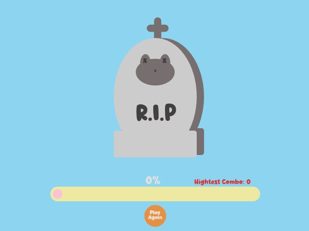
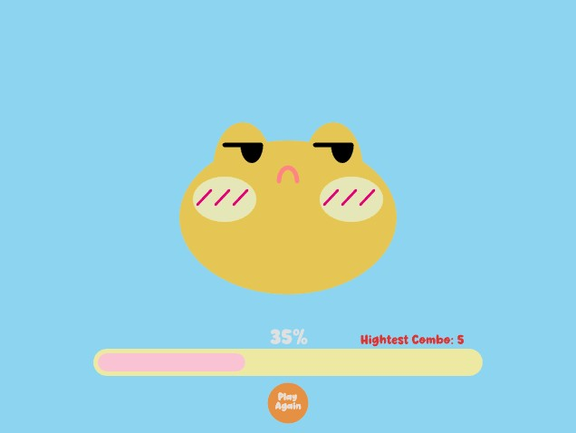
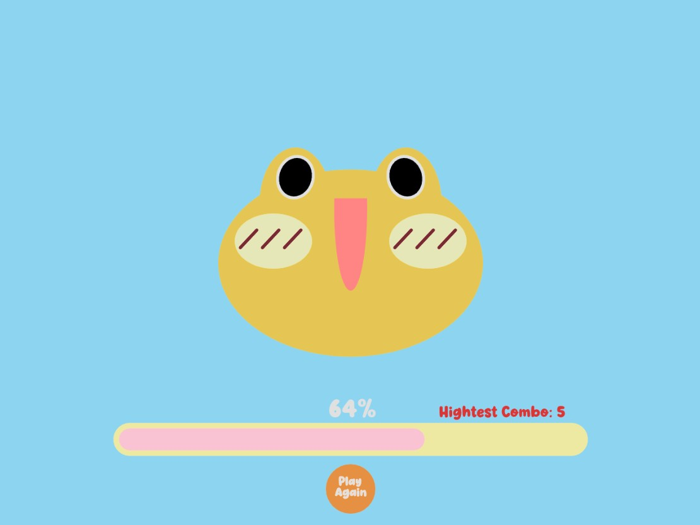
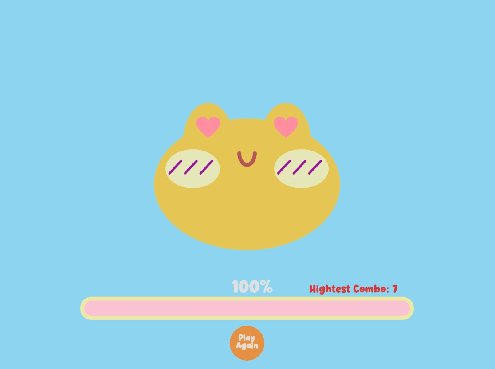

# 🐸 Hungry Frog

WEINI WANG

[View this project online](https://bbwinnie.github.io/cart253/topics/assignment/mod-jam/frogfrogfrog/)

## Description

Hungry Frog is an interactive digital mini-game created with p5.js.

Your goal is simple: within 15 seconds, catch as many flies as you can with your frog’s tongue!

🎮 Controls
    > Press and hold the mouse — Start the game
    > Move the mouse — Control the frog’s position 
    > Click — Launch the frog’s tongue
    > Catch flies — Earn points and trigger combos
    > Press any key — Turn the current fly into a bomb for a second player
    > Combo & Score System — Unlock fun emojis as your score increases
    > Game Over? — You can always play again!

🎨 Design Details
    > The frog’s mouth gradually grows to start the game
    > The game ends automatically after 15 seconds
    > The fly moves in a sine-wave pattern with random positions 
    > A second player can transform the fly into a bomb
    > The fly has visual effects — flapping wings and dynamic color changes 
    > The frog’s eyes follow the fly’s movement 
    > The frog visually “eats” the fly and pulls it back into its mouth
    > A score bar displays your progress and total score

## Screenshot(s)

## Attribution

- This project uses [p5.js](https://p5js.org).

The function I used on P5.js:
- Inspired by Sabine’s class notes on timing and screen systems.
- Translate [p5.js/translate](https://p5js.org/reference/p5/translate/)
- Anglemode [p5.js/Anglemode](https://p5js.org/reference/p5/angleMode/)
- Arc[p5.js/arc](https://p5js.org/reference/p5/arc/)
- Text[p5.js/text](https://p5js.org/reference/p5/text/)
- Preload[p5.js/preload](https://p5js.org/reference/p5/preload/)
- LoadSound[p5.js/loadSound](https://p5js.org/reference/p5/loadSound/)
- IsPlaying[p5.js/isPlaying](https://p5js.org/reference/p5.SoundFile/isPlaying/)
- play[p5.js/Play](https://p5js.org/reference/p5.SoundFile/play/)
- loadFont[p5.js/loadFont](https://p5js.org/reference/p5/loadFont/)
- textFont[p5.js/textFont](https://p5js.org/reference/p5/textFont/)
- Int[p5.js/int](https://p5js.org/reference/p5/int/)
- heart shape is inspired by p5.js (https://editor.p5js.org/monicamonin/sketches/hWHc3EuFh)

## License

This project is licensed under a Creative Commons Attribution ([CC BY 4.0](https://creativecommons.org/licenses/by/4.0/deed.en)) license with the exception of libraries and other components with their own licenses.
