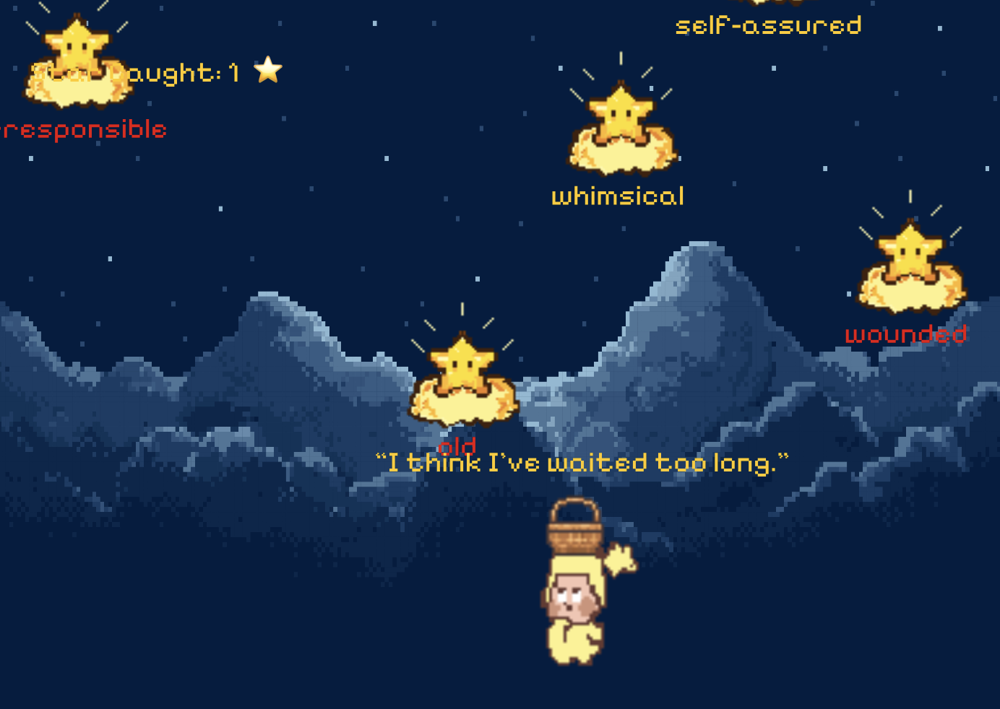
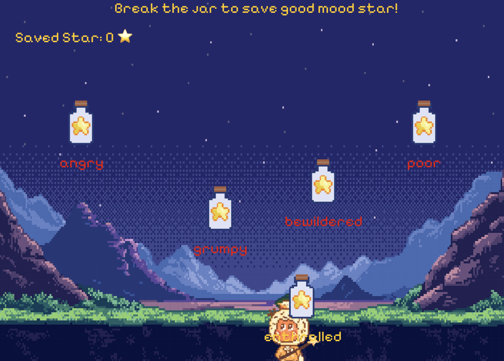
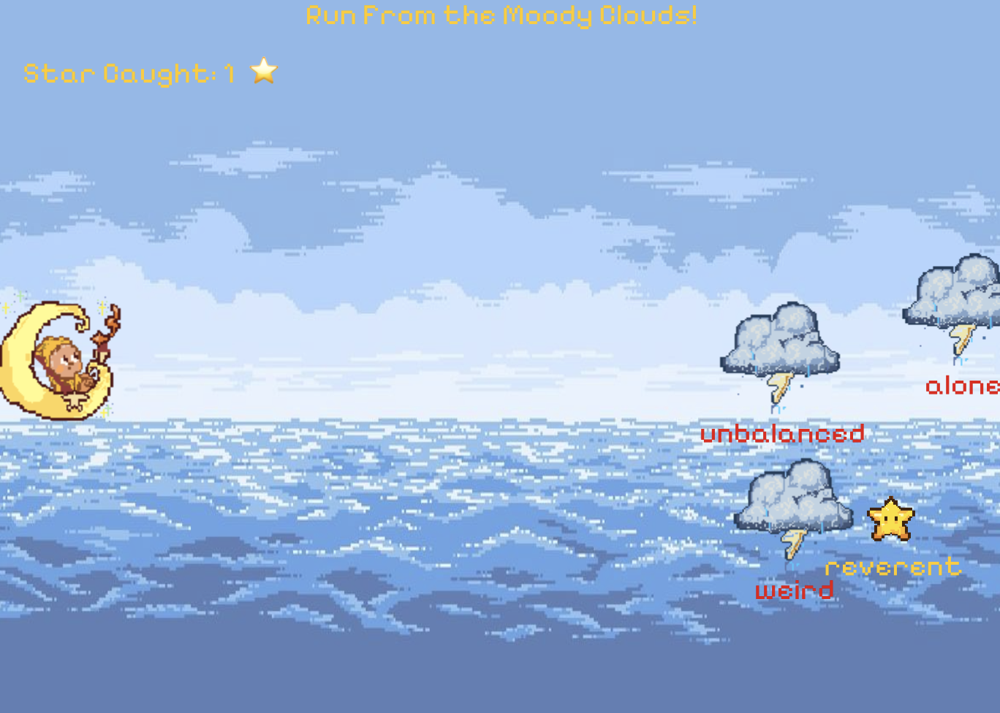

# Star Village

Weini Wang

[View this project online](https://bbwinnie.github.io/cart253/topics/assignment/variation-jam/star%20village/)

## Description

A Three-Part Interactive Experience

Star village is a small collection of three mini-games designed to gently guide the player’s attention away from moments of anxiety or panic. Each game provides simple, calming interactions that help the mind focus on movement, color, and small goals. The experience is meant to feel encouraging, playful, and quietly supportive.

The project is controlled with both the keyboard and mouse.

- In Magic Basket, the player moves a basket to catch falling stars and collect positive mood words. (Using mouse to control)

- In Star Wand, the player using magic stars to break jars to rescuing those good mood star that trapped in jars. (using mouse click to control)

- In Moon Boat, the player steers a small boat across the sky, avoiding rain clouds while gathering light from drifting stars.(using arrow key or WSAD to control)

Each time the player collects a magic item, a small “passed” animation appears to celebrate their progress. After finishing all three mini-games, the player can simply click or press any key to restart the experience. The game can also be paused at any time by pressing the Esc key, which brings up a pause menu with options to continue or return to the main menu.

By giving the player simple tasks and gentle visual feedback, the game helps shift attention away from overwhelming thoughts and into a small magical world. The appearance of kind and encouraging words throughout the experience aims to remind the player that they are safe, capable, and not alone—even in stressful moments.

There were a few challenges while i doing this game, such as how to shoot stars toward the mouse angle, how to prevent the boat from going out of bounds, and how to draw pentagrams. However, through research and online exploration, I was able to solve most of these problems. The remaining challenge is how to create a short animation every time a building is destroyed, which I hope to improve in future versions of the game.

## Screenshot(s)

> 
> 
> 
> 
> 
> 
> 
> 
> 

## Attribution

> - This project uses [p5.js](https://p5js.org).
> - Using p5.js Star example [p5.js](https://archive.p5js.org/examples/form-star.html).
> - All of the characters and game items were drawn using Aseprite.
> - All the sound effect is from pixabay.com: https://pixabay.com/sound-effects/.

## License

This bit should include the license you want to apply to your work. For example:

> This project is licensed under a Creative Commons Attribution ([CC BY 4.0](https://creativecommons.org/licenses/by/4.0/deed.en)) license with the exception of libraries and other components with their own licenses.